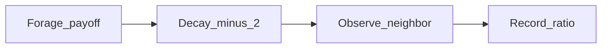

# Foraging Strategy Diffusion ABM — Plan (from PROMPT.md)

## Scientific goal

Demonstrate how dominance of one foraging strategy can emerge from a local social imitation rule. Agents on a **ring** interact only with left/right neighbors. Fixed population. State per agent: **strategy** (risky | safe) and **accumulated food**. Primary measured outcome: **risky/safe agent ratio over time**.

## Model dynamics (per timestep)



1. **Forage:** stochastic payoff by strategy (food floored at 0 after payoff)
   - Risky: 40% +8, 60% −2
   - Safe: 50% +4, 50% +0
2. **Decay:** every agent loses **2 food**; `food = max(0, food − 2)`
3. **Imitate:** each agent picks a random neighbor (left or right)
   - Copy probability = **0** if neighbor has equal/less food OR same strategy
   - Otherwise softmax: P(copy) increases with `Δfood = neighbor.food − agent.food` (strict `>` required)
   - Guard zero-division (`β = 0`, `Δfood = 0` → P = 0)

Imitation reads food **after** payoff and decay. Updates are **synchronous** (all forage, then all decay, then all imitate).

---

## 1. Class hierarchy and data flow

```
SimulationConfig
      │
      ▼
   Agent ──► ForagingABM ──► run_simulation() ──► SimulationResult
      │          │ step: forage → decay → imitate
      │          └── ratio_trajectory (T+1,), final_ratio
      └── strategy, food
                │
                ▼
     average_ratio_trajectory() ──► TrajectoryBatchResult
     (n_runs, 50/50 start)            mean/std trajectory (T+1,)
                │
    ┌───────────┴────────────┐
    ▼                        ▼
save_diagnostic_figures   starting_ratio_sweep()
    │                        │
    ▼                        ▼
results/*.png           SweepResult
```

| Component | Responsibility |
|---|---|
| `Agent` | `strategy`, `food`; `forage()`, `apply_decay()` |
| `SimulationConfig` | All parameters: population, timesteps, payoffs, `food_decay=2`, `beta`, seeds, verification overrides |
| `ForagingABM` | Ring topology, synchronous `step()`, `run()` with ratio history |
| `run_simulation()` | Single replicate |
| `average_ratio_trajectory()` | Multiple runs at 50/50 start → mean ± std trajectory |
| `starting_ratio_sweep()` | Vary initial risky/safe ratio → mean ± std **final** ratio |
| `save_diagnostic_figures()` | Headless PNG export |
| `main()` | Demo: batch + sweep → `results/` |

Running python run_simulation.py must product outputs automatically. Create `results/` if necessary.

---

## 2. Architecture

### Agent state

| Field | Type | Initial | Updated |
|---|---|---|---|
| `strategy` | `"risky"` \| `"safe"` | From `n_risky` or fraction | Imitation (stochastic) |
| `food` | `float` | `0.0` | Forage, then decay; floored at 0 each step |

### Configurable payoffs (default matches PROMPT)

```python
payoffs = {
    "risky": [(0.40, +8), (0.60, -2)],
    "safe":  [(0.50, +4), (0.50,  0)],
}
food_decay: float = 2.0   # set 0.0 to disable for checks
beta: float = 1.0
copy_probability: float | None = None   # e.g. 0.0 fixes imitation off
fixed_food: float | None = None         # skip forage + decay when set
n_risky: int | None = None              # direct strategy assignment
```

### Imitation (softmax)

Gate: `neighbor.food > agent.food` AND `neighbor.strategy != agent.strategy`.

When gate passes:

`P(copy) = exp(β·Δfood) / (exp(0) + exp(β·Δfood)) = 1 / (1 + exp(−β·Δfood))`

If `copy_probability` is set, use that constant after the gate.

### History tracking

- **`SimulationResult`:** `ratio_trajectory` length `n_timesteps + 1` (includes t=0), `final_ratio`, final counts
- **`TrajectoryBatchResult`:** `mean_trajectory`, `std_trajectory` each `(T+1,)`, `mean_final_ratio`, `std_final_ratio`, `n_runs`
- **`SweepResult`:** `start_ratios`, `mean_final_ratios`, `std_final_ratios` each `(R,)`

### `average_ratio_trajectory`

- Force `n_risky = n_agents // 2` (50% risky, 50% safe → ratio 1.0 at t=0)
- Run `n_runs` replicates with sub-seeds; element-wise mean/std over runs

### `starting_ratio_sweep`

Per start ratio `r`:

`n_risky = max(1, min(n−1, round(r / (1+r) * n_agents)))`

Shuffle assignment, run `n_runs_per_ratio` replicates, aggregate final ratios.

### Demo defaults

| Parameter | Value |
|---|---|
| `n_agents` | 100 |
| `n_timesteps` | 500 |
| `food_decay` | 2.0 |
| `beta` | 1.0 |
| `seed` | 42 |
| `n_runs` (trajectory) | 30 |
| `n_runs_per_ratio` (sweep) | 30 |
| `sweep_start_ratios` | 20 points, 0.2 to 5.0 |

### Figures (headless, `matplotlib.use("Agg")`)

| File | Content |
|---|---|
| [`results/ratio_trajectory.png`](repo/abm-project/results/ratio_trajectory.png) | Mean risky/safe ratio ± std vs timestep (50/50 start batch) |
| [`results/final_ratio.png`](repo/abm-project/results/final_ratio.png) | Final risky/safe counts or ratio from batch |
| [`results/starting_ratio_sweep.png`](repo/abm-project/results/starting_ratio_sweep.png) | Initial ratio vs mean final ratio ± std |

---

## 3. Return shapes

| API | Returns | Shape |
|---|---|---|
| `risky_to_safe_ratio(agents)` | `float` | scalar; `inf` if no safe, `0.0` if no risky |
| `run_simulation(config)` | `SimulationResult` | trajectory `(T+1,)`, scalar final ratio |
| `average_ratio_trajectory(config, n_runs)` | `TrajectoryBatchResult` | mean/std `(T+1,)` |
| `starting_ratio_sweep(config, ratios, n_runs)` | `SweepResult` | three arrays `(len(ratios),)` |
| `save_diagnostic_figures(...)` | `list[Path]` | 3 paths |

---

## 4. Edge cases and ambiguities

| Issue | Resolution |
|---|---|
| Homogeneous population | Ratio `inf` (all risky) or `0.0` (all safe); no opposite-strategy neighbors → ratio stays fixed |
| Food floor | `max(0, ·)` after payoff and after decay |
| Low food + decay | Food clamps to 0, never negative |
| Equal food | Copy P = 0 (strict inequality) |
| Same-strategy neighbor | Copy P = 0 |
| `β = 0` or `Δfood = 0` | Copy P = 0 |
| Net EV with decay | Payoff EV +2.0 each strategy; after decay −2 → net 0 EV; imitation drives diffusion, not mean food gain |
| `inf` in plots | Clip y-axis or filter for display only |
| Synchronous updates | No per-agent ordering bias within a step |
| Reproducibility | `seed` + `seed + run_index` for batch/sweep |

---

## 5. Verification checks

All via `SimulationConfig` overrides; automate in [`tests/test_run_simulation.py`](repo/abm-project/tests/test_run_simulation.py).

| Check | Config | Expected |
|---|---|---|
| No imitation | `copy_probability=0.0` | Strategy counts unchanged; ratio constant |
| Fixed food | `fixed_food=K` (skip forage + decay) | Equal food → no copying; ratio constant |
| Homogeneous start | `n_risky=0` or `n_risky=n_agents` | Ratio frozen at 0 or `inf` |
| Custom payoffs | Replace `payoffs` dict | EV/variance controllable independently of decay |
| Food floor | Negative payoff config | `food >= 0` always |
| Decay | `food_decay=2`, zero-variance payoffs | Food drops by 2/step until 0 |

---

## Repository layout and milestones

```
abm-project/
    PROMPT.md                 # provided
    PLAN.md                   # this plan (update on confirm)
    run_simulation.py         # single implementation file
    results/                  # created at runtime
        ratio_trajectory.png
        final_ratio.png
        starting_ratio_sweep.png
    tests/
        test_run_simulation.py
    Dockerfile, README.md     # user-provided
```

| Milestone | Deliverable |
|---|---|
| M1 | `SimulationConfig`, `Agent`, `ForagingABM` scaffold |
| M2 | Forage + decay + food floor |
| M3 | Imitation gate + softmax + overrides |
| M4 | `run_simulation`, `SimulationResult` |
| M5 | `average_ratio_trajectory`, `TrajectoryBatchResult` |
| M6 | `starting_ratio_sweep`, `SweepResult` |
| M7 | `save_diagnostic_figures` + `main()` |
| M8 | `tests/test_run_simulation.py` (10 checks) |
| M9 | `python run_simulation.py` → 3 PNGs; unittest green |

---

## Test and verification strategy

1. **Unit tests** (`unittest`, small `n_agents`, short `n_timesteps`)
2. **Smoke test:** `python run_simulation.py` writes all three PNGs
3. **Sanity:** 50/50 start + `copy_probability=0` → ratio stays 1.0

---

## Risks

| Risk | Mitigation |
|---|---|
| Softmax mis-spec | Document formula; configurable `beta` |
| `inf` ratios break plots | Explicit handling + y-axis clip |
| Stochastic noise | Average ≥30 runs; plot ± std bands |
| Headless matplotlib | `Agg` backend before pyplot import |
| Decay → all food at 0 | Expected; imitation needs transient payoff differences |
| Scope creep | Single file ~300 lines; dataclasses only |

---

## Dependencies

Python ≥ 3.10, `numpy`, `matplotlib`. `pytest`/`unittest` for tests only. No `scipy`.

## Out of scope

Spatial ring viz, per-agent food history, CLI args, CSV export.

---

**Deliverable on execution:** implement [`run_simulation.py`](repo/abm-project/run_simulation.py) and tests per milestones above.
